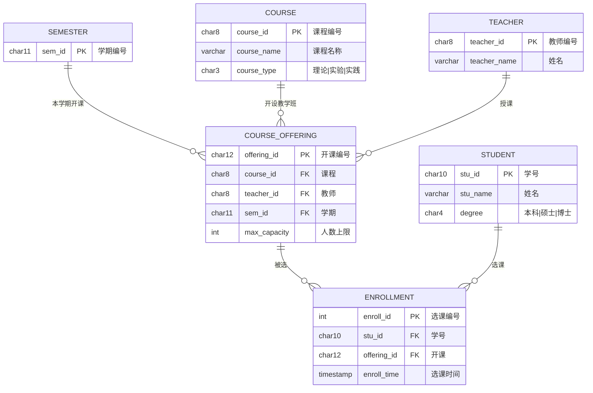
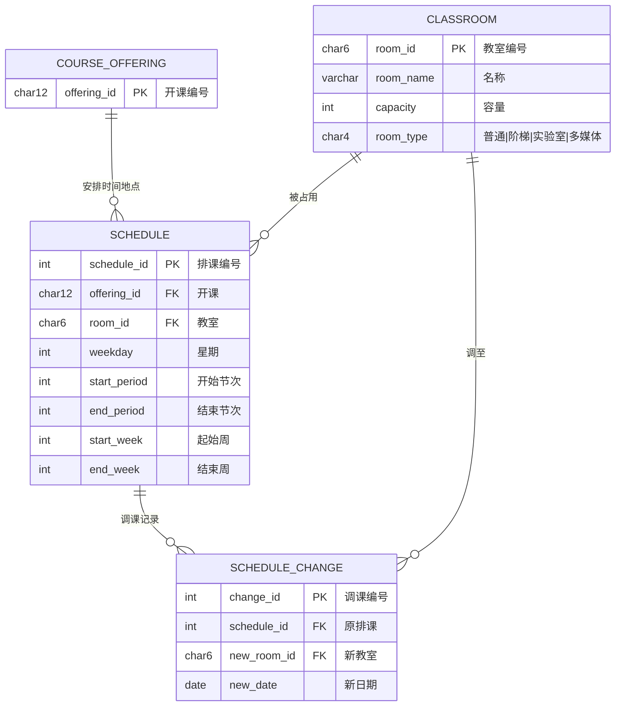
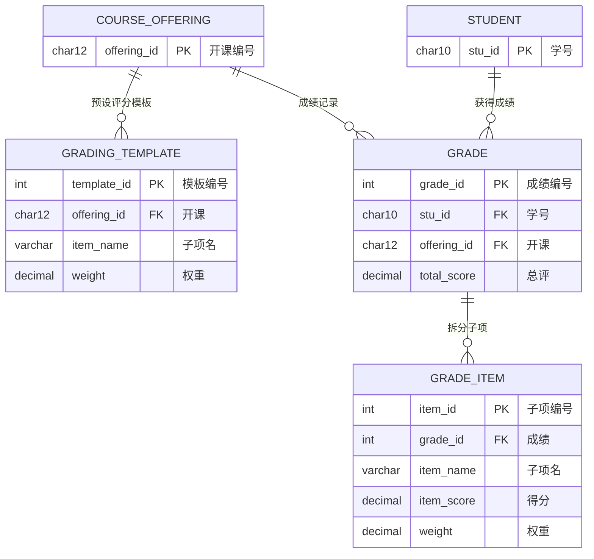
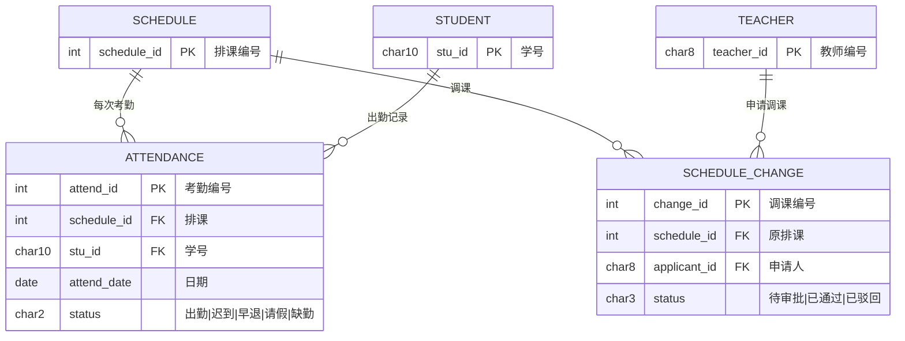
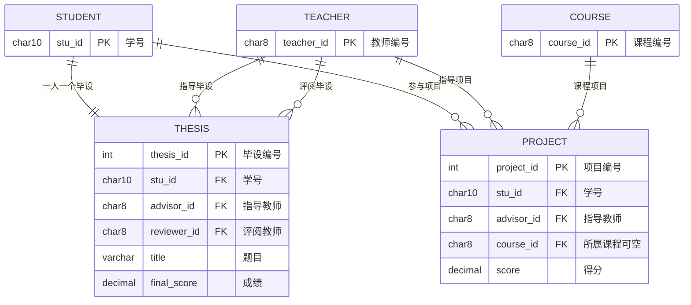
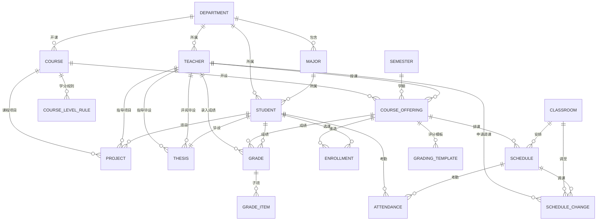

# 数据库表结构图

> 基于《需求分析说明书》，18 张表，按业务流分层展示，关系一目了然。

---

## 一、核心业务流总览（一条线看懂系统）

```
                    ┌─────────────────────────────────┐
                    │         ① 学期 SEMESTER          │
                    └──────────────┬──────────────────┘
                                   │ 本学期开哪些课?
    ┌──────────────────┐          ▼
    │ ② 课程 COURSE    │──────────────────────┐
    │   (课程目录)      │ 1:N                  │ 1:N
    │   ┌─────────────┐│                      │
    │   │LevelRule    ││   ③ 开课 COURSE_OFFERING ◄─── ⑨ 教师 TEACHER
    │   │(本/研学分)   ││      (教学班,具体某学期)         (授课人)
    │   └─────────────┘│       │
    └──────────────────┘       │
                               ├──► ④ 选课 ENROLLMENT ◄─── ⑩ 学生 STUDENT
                               │      (学生选了哪个班)        (选课人)
                               │
                               ├──► ⑤ 排课 SCHEDULE ────► ⑦ 教室 CLASSROOM
                               │      (何时何地上课)         (上课地点)
                               │           │
                               │           ├──► ⑧ 调课 SCHEDULE_CHANGE
                               │           │      (时间/地点变更)
                               │           │
                               │           └──► ⑰ 考勤 ATTENDANCE ◄── 学生
                               │                  (每次到课情况)
                               │
                               ├──► ⑥ 成绩体系
                               │      ├── GRADING_TEMPLATE (评分模板,预设权重)
                               │      ├── GRADE            (总评成绩)
                               │      └── GRADE_ITEM       (成绩子项:平时/期中/期末...)
                               │
                               └──► 扩展业务
                                      ├── ⑮ 毕业设计 THESIS ◄── 教师(指导+评阅)
                                      └── ⑯ 项目设计 PROJECT ◄── 教师(指导)
```

> **一句话概括**：学期里，教师为课程开设教学班 → 学生选班 → 教务排时间教室 → 日常考勤 → 期末评分。毕业设计和项目独立管理。

---

## 二、分层架构（从上到下：基础 → 业务 → 流水）（FK（foreign key）：外键，PK（primary key）：主键,NOT NULL（not null constraint）：非空约束,UK（unique constraint）：唯一约束）

```
┌──────────────────────────────────────────────────────────────────────┐
│                          L0  基础字典层（全局共享）                     │
│                                                                      │
│   ┌──────────┐    1:N     ┌──────────────┐                           │
│   │DEPARTMENT│──────────►│    MAJOR     │    ┌──────────┐            │
│   │  院系    │            │    专业       │    │ SEMESTER │            │
│   └────┬─────┘            └──────┬───────┘    │  学期     │            │
│        │ 学生/教师/课程都FK到这   │ 学生FK到这   └────┬─────┘            │
│        │                        │                   │               │
├────────┴────────────────────────┴───────────────────┴───────────────┤
│                          L1  主体实体层                              │
│                                                                      │
│     ┌──────────┐              ┌──────────┐                          │
│     │  STUDENT │              │ TEACHER  │     ┌──────────┐         │
│     │   学生    │              │   教师    │     │  COURSE  │         │
│     └────┬─────┘              └────┬─────┘     │  课程目录 │         │
│          │                         │           └────┬─────┘         │
│          │                         │                │               │
│          │                         │        ┌───────┴───────┐       │
│          │                         │        │COURSE_LEVEL_  │       │
│          │                         │        │    RULE       │       │
│          │                         │        │ 本研学分规则    │       │
│          │                         │        └───────────────┘       │
│          │                         │                                │
├──────────┼─────────────────────────┼────────────────────────────────┤
│          │          L2  核心业务层（一切从这里串联）                   │
│          │                         │                                │
│          │    ┌────────────────────┼──────────────────┐             │
│          │    │              COURSE_OFFERING           │             │
│          │    │                开课（教学班）            │             │
│          │    │  FK→课程  FK→教师  FK→学期              │             │
│          │    └──┬───────────────┬─────────────────┬──┘             │
│          │       │               │                 │                │
│          │       ▼               ▼                 ▼                │
│          │  ┌─────────┐    ┌──────────┐    ┌──────────────┐        │
│          │  │ENROLLMENT│   │ SCHEDULE │    │    GRADE      │        │
│          │  │   选课    │   │   排课    │    │   成绩总表    │        │
│          │  │FK→学生    │   │FK→教室    │    │FK→学生        │        │
│          │  │FK→开课    │   │          │    │FK→开课        │        │
│          │  └──────────┘   └────┬─────┘    └───────┬──────┘        │
│          │                      │                   │               │
├──────────┼──────────────────────┼───────────────────┼───────────────┤
│          │        L3  业务流水层（依赖于L2）          │               │
│          │                      │                   │               │
│          │                 ┌────┴─────┐       ┌─────┴──────┐       │
│          │                 │          │       │ GRADE_ITEM  │       │
│          │            ┌────▼───┐ ┌───▼────┐  │  成绩子项    │       │
│          │            │ATTEND- │ │SCHEDULE│  │FK→GRADE     │       │
│          │            │ ANCE   │ │_CHANGE │  └─────────────┘       │
│          │            │  考勤   │ │  调课   │                       │
│          │            │FK→排课  │ │FK→排课  │  ┌──────────────┐    │
│          │            │FK→学生  │ │FK→教室  │  │GRADING_      │    │
│          │            └────────┘ │FK→教师  │  │TEMPLATE      │    │
│          │                       └────────┘  │  评分模板     │    │
│          │                                   │FK→开课        │    │
│          │                                   └──────────────┘    │
│          │                                                        │
├──────────┴────────────────────────────────────────────────────────┤
│                       L4  独立业务层（直接关联 L1 主体）              │
│                                                                      │
│     ┌──────────────┐              ┌──────────────┐                 │
│     │    THESIS    │              │   PROJECT    │                 │
│     │    毕业设计   │              │   项目设计    │                 │
│     │FK→学生(1:1)  │              │FK→学生       │                 │
│     │FK→导师       │              │FK→导师       │                 │
│     │FK→评阅教师   │              │FK→课程(可空)  │                 │
│     └──────────────┘              └──────────────┘                 │
│                                                                      │
│     教室 CLASSROOM 也属于这一层——被 SCHEDULE 和 SCHEDULE_CHANGE FK   │
│     ┌──────────────────────────────┐                                │
│     │         CLASSROOM            │                                │
│     │      教室(大小/类型/设备)     │                                │
│     └──────────────────────────────┘                                │
└──────────────────────────────────────────────────────────────────────┘
```

---

## 三、按业务场景拆分的子图

### 子图 A：选课流程（谁选了谁的什么课）



### 子图 B：排课流程（什么课在何时何地上课）



### 子图 C：成绩流程（怎么给分）



### 子图 D：考勤 + 调课流程



### 子图 E：毕业设计 & 项目设计



---

## 四、完整 Mermaid ER 图

> 以下为全部 18 张表的完整关系图，可与上方子图对照阅读。



---

## 五、关系矩阵（一眼看出谁连着谁）

| 表名 | 数量 | 被哪些表 FK 引用 | FK 指向哪些表 |
|------|:--:|------|------|
| **Department** | 1 | Student, Teacher, Course, Major | — |
| **Major** | 1 | Student | Department |
| **Semester** | 1 | CourseOffering | — |
| **Student** 👤 | 1 | Enrollment, Grade, Thesis, Project, Attendance | Department, Major |
| **Teacher** 👤 | 1 | CourseOffering, Thesis(×2), Project, Grade, ScheduleChange | Department |
| **Course** 📚 | 1 | CourseLevelRule, CourseOffering, Project | Department, Course(自引用) |
| **Classroom** 🏫 | 1 | Schedule, ScheduleChange | — |
| **CourseLevelRule** | 1 | — | Course |
| **CourseOffering** 🔗 | 1 | Enrollment, Schedule, Grade, GradingTemplate | Course, Teacher, Semester |
| **Enrollment** | 1 | — | Student, CourseOffering |
| **Schedule** | 1 | Attendance, ScheduleChange | CourseOffering, Classroom |
| **ScheduleChange** | 1 | — | Schedule, Classroom, Teacher |
| **Grade** | 1 | GradeItem | Student, CourseOffering, Teacher |
| **GradeItem** | 1 | — | Grade |
| **GradingTemplate** | 1 | — | CourseOffering |
| **Attendance** | 1 | — | Schedule, Student |
| **Thesis** | 1 | — | Student, Teacher(导师), Teacher(评阅) |
| **Project** | 1 | — | Student, Teacher, Course |

> **总表数: 18** | **总 FK 关系: 27 条**

---

## 六、关系强度分类

| 强度 | 关系 | 说明 |
|:--:|------|------|
| ⭐⭐⭐ | CourseOffering ← Enrollment → Student | **核心：选课** | 
| ⭐⭐⭐ | CourseOffering → Schedule → Classroom | **核心：排课** |
| ⭐⭐⭐ | Student + CourseOffering → Grade → GradeItem | **核心：成绩** |
| ⭐⭐ | Course → CourseLevelRule | 本研学分区分 |
| ⭐⭐ | Schedule → Attendance ← Student | 日常考勤 |
| ⭐⭐ | Schedule → ScheduleChange | 调课管理 |
| ⭐ | Student → Thesis | 毕业设计(1:1) |
| ⭐ | Student → Project | 项目设计 |
| ⭐ | Department → (Student, Teacher, Course, Major) | 基础归属 |
